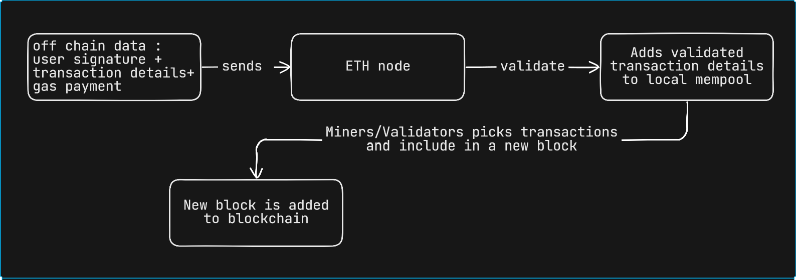
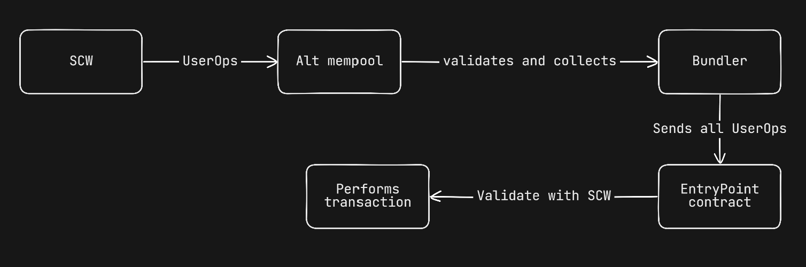

# Topics 
1. Understanding Account Abstraction

Classic Transactions before account abstraction
- Private key == wallet (i.e private key handles all the transactions and signs all the transactions)

However, with account abstraction, wallets are no longer just private keys. They can be smart contracts that can be programmed to handle transactions in different ways.

This allows for more flexibility and customization when it comes to managing your crypto assets.

2. Working of Account Abstraction (ERC-4337)(ETH) vs Native(ZkSync)
## ERC-4337 (Account Abstraction)
- Includes a special smart contract `EntryPoint.sol` and an alternative mempool for user operations.
- This standard is build on top of Ethereum protocol

## Native Account Abstraction (ZkSync) : More streamlined and integrated experience
- Account Abstraction is built into the protocol itself.

### Traditional Ethereum transaction flow

### Account Abstraction via EIP-4337 
Key components for Account abstraction
1. Deploy Smart Contract Wallet : *SCW*
Instead of using Externally Owned Account like metamask users interact with **Smart Contract Wallet** 
- Smart Contract Wallet : Smart contract deployed on chain contains custom logic for validation for valid authorization for a specific account
- The custom logic may include muti-sign or signature from specific key or any off chain authorization

2. User Operation : *UserOp*
When a user sends a transaction or performa any action their wallet interface **SCW** constructs **UserOp** object(defined in EIP-4337 standard)

*** UserOp ***
UserOp contains 
    1. sender : Address of user's SCW
    2. nonce : Seq number to prevent replay attacks
    3. calldata : Actual call to be executed by SCW : Functional call and parameters for ERC20 transfer
    4. callGasLimit : Limit of gas for the call
    5. paymaster data : Optional, for gas sponsorship
    6. signature : Signature of the user satisfying the custom logic for validation in SCW

This *UserOp* signed according to SCW defined validation logic is send to off-chain **Alternative mempool** (separate from main ETH mempool)

3. Bundler : Specialized nodes participating in Alt Mempool network
Steps followed by bundler
    1. Listen **User Ops** in Alt Mempool
    2. Validate the *UserOp* (Check signature) against target SCW
    3. group multiple *UserOps* into a single **Bundle**
    4. Send this Bundle to the Ethereum network as a single transaction
    5. **Bundler** pays gas fees for the transaction in ETH (i.e for the whole bundle) later compensated by Paymaster or SCW of user

### Bundler working
Bundler submits the entire **UserOps** to a single contract **EntryPoint.sol**(addr:`0x5FF137D4b0FDCD49DcA30c7CF57E578a026d2789`)

**EntryPoint** contract performs the following operations
    1. Validate each UserOp in the bundle with respect to target **SCW** by `validateUserOp` method
    2. Checks if the SCW has enough funds to pay for the gas fees of the transaction or if **Paymaster** agreed to pay for the gas fees

4. Transaction Execution : SCW executing the transaction
If the validation step in EntryPoint.sol (which involves calling the SCW's validation logic) is successful, EntryPoint.sol then calls another function on the user's SCW to execute the actual intended operation. This is where the callData from the UserOp is executed

**IMPORTANT** : During the execution phase the target dApp or target smart contract doesn't know about **EntryPoint** or **Bundler**. It only interacts with the **User's Smart Contract Wallet**.
This is a key aspect of ERC-4337 that allows it to be backward compatible with existing smart contracts.

5. Signature Aggregators (OPTIONAL)
EIP-4337 supports the use of Signature Aggregator contracts. These contracts can be used by **EntryPoint.sol** to validate aggregated signatures (e.g., BLS signatures). 
This is particularly useful for multi-sig SCWs or for batching operations, as it can significantly reduce gas costs by verifying multiple signatures in a single operation.

7. Paymasters (OPTIONAL)
As mentioned, a Paymaster is a smart contract that can agree to pay the gas fees for a UserOp. 
The UserOp can specify a Paymaster contract and include data that the Paymaster requires for its validation (e.g., a signature from the dApp sponsoring the transaction). 
If a Paymaster is used and successfully validates, it reimburses the Bundler via the EntryPoint.sol contract. 
If no Paymaster is used, the user's SCW must have sufficient native token balance, which EntryPoint.sol will transfer to the Bundler as compensation.

### Native Account Abstraction on ZkSync : Integrate AA directly into their core protocol : No Alternative Mempool!
*Every account is a Smart contract wallet* : Whenever user creates an account on ZkSync using metamask or any other wallet interface , a smart contract wallet is deployed on the chain

This native approach bypasses the need for a separate **Alt Mempool** and the **EntryPoint.sol** contract, as the core protocol itself is designed to handle programmable account validity.

Account abstraction transactions on zkSync are designed as Type-113

**BootLoader** : During both validation and execution the `msg.sender` to **SCW** will be `BootLoader`  address

**Smart Contract as from Address** : A significant distinction is that in zkSync, the `from` field of a Type 113 transaction can be the address of the **Smart Contract Wallet** itself. This contrasts with Ethereum, where the from field is always an **EOA**

**IMPORTANT** : This default account contract (e.g., DefaultAccount.sol in the matter-labs/era-contracts repository) implements standard interfaces like IAccount and includes functions such as validateTransaction, executeTransaction, and isValidSignature. By default, this contract mimics traditional EOA behavior, validating transactions based on an ECDSA signature from the associated private key. 

However, users or developers can override this default implementation by deploying custom smart contract code to their account address. This custom code can then define any arbitrary validation logic, effectively turning any account into a fully programmable smart contract wallet.

### Flow of Native Account Abstraction on ZkSync
1. Off chain : user signs a transaction
2. On chain : The signed transaction is sent to zkSync nodes. These nodes natively understand AA and can directly call the validation logic within the user's account contract.
3. If valid, the transaction is executed by the user's account contract, and the results are included in a block on the zkSync blockchain.

2. Ethereum Approach to account abstraction (EIP-4337)
Components of ERC-4337
1. *EntryPoint* contract
2. *UserOps*
3. *Alt mempool*
4. *Bundler*

### Ethereum AA implementation
The `MinimalAccount.sol` contract : github.com/Cyfrin/minimal-account-abstraction repo is a basic example for ERC-4337 (i.e Account Abstraction) 

Core functionalities : 
1. `permit` function : Permits transaction initiation by its owner or the `EntryPoint` contract
2. `validateUserOp` function : Validates the user operation
3. `execute` function by `EntryPoint` contract : Executes the user operation

### zkSync AA implementation
The `ZkMinimalAccount.sol` contract, located in `src/zksync/` of the repository, demonstrates a basic smart contract wallet utilizing zkSync's native AA.

Core functions
1. `validateTransaction` : Called by bootloader, validates the incoming transaction mainly includes verifying signatures and incrementing nonce
2. `executeTransaction` : After succeessful validation in `validateTransaction` function **Bootloader** calls this function for execution of actual logic defined in the `_transaction` payload
3. `payForTransaction` : Handles payment of transaction fees